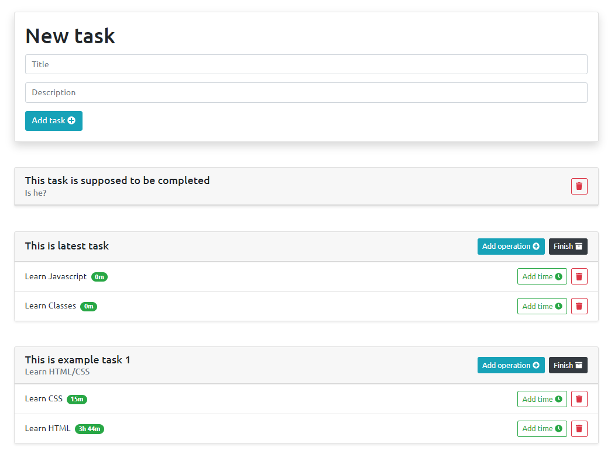

# ToDoList

Simple app to add tasks and measure completion time. It uses external API to get, create and manage tasks from external server. It is my first attempt to handling API.




# Install

All dependencies are set up in webpack.config.js so all you need to do to run this project is:

```shell
npm install
```

```shell
npm run start
```
